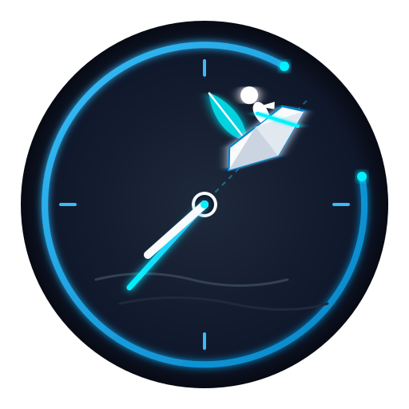
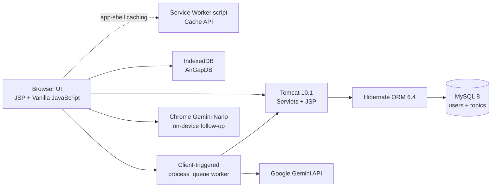
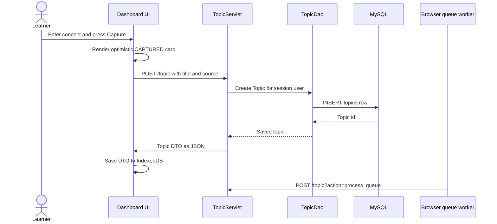
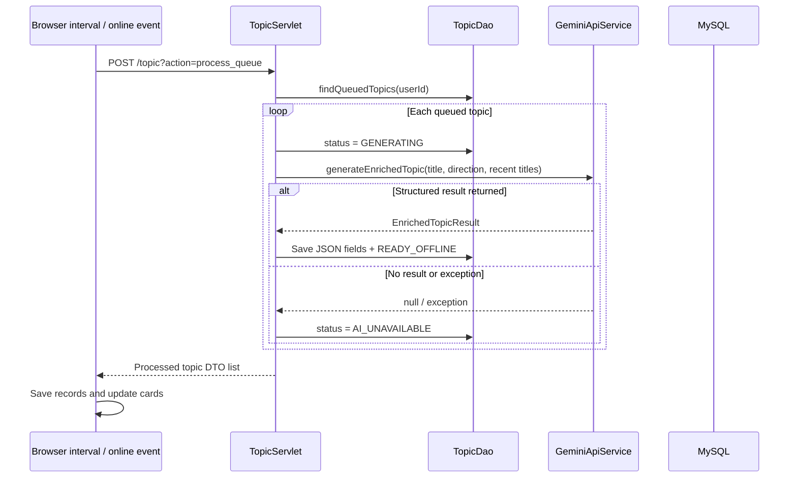
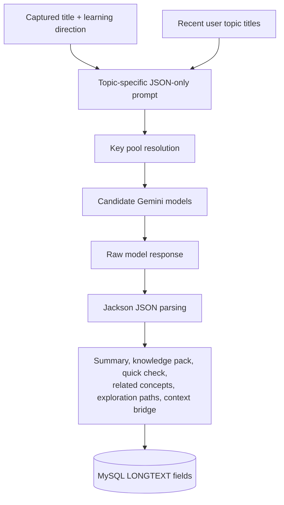
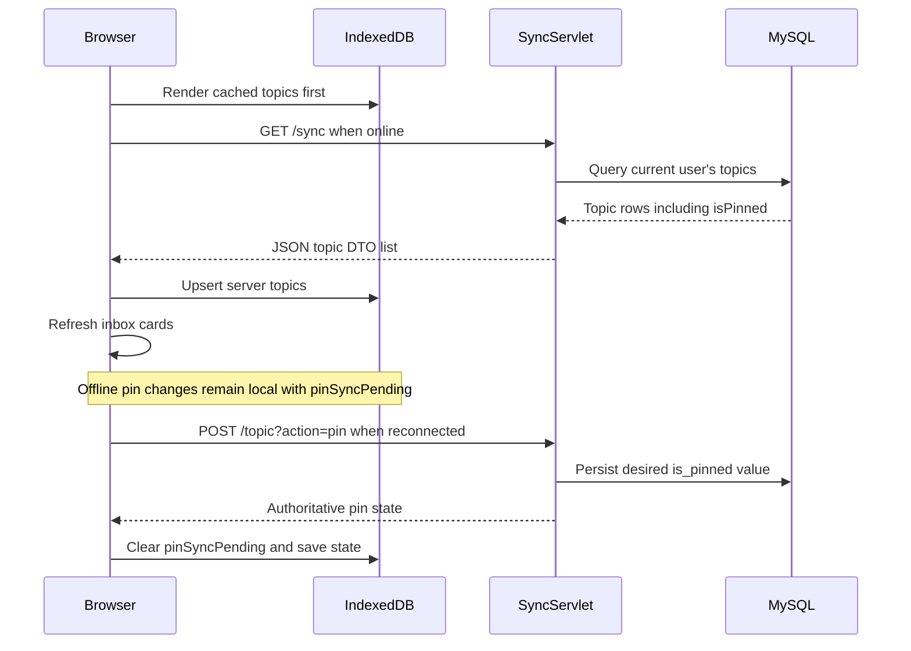
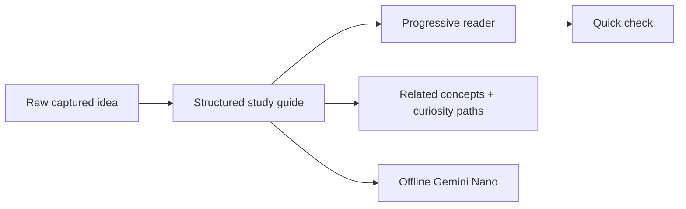
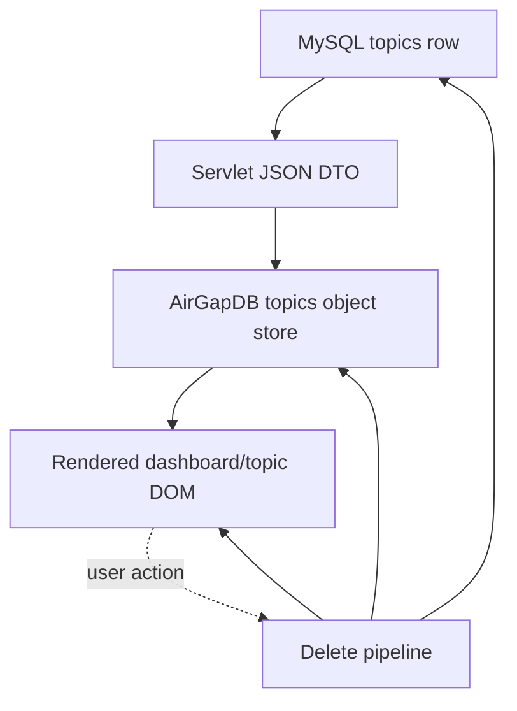

# AirGap Study

<p align="center">
  
</p>

<p align="center"><strong>For every "I'll learn this later." moment.</strong></p>

AirGap Study is a Java web application for capturing concepts when curiosity appears, enriching them when a connection is available, and studying the resulting guide later from local browser storage.

It was built for a specific environment: classrooms, laboratories, and college spaces where internet access is unreliable or unavailable. The application separates the moment of discovery from the moment of study:

```text
Capture once  →  Enrich when online  →  Study offline
```

The project is not intended to replace books, courses, or careful research. It is a personal system for making sure a useful question is not lost just because the network is unavailable.

> This README describes the implementation currently present in the repository. It deliberately calls out a few capabilities that are present in code but still require operational setup, such as service-worker registration and Chrome Gemini Nano availability.

## Why I Built This

The idea came from repeated moments during engineering college. A lecture would mention Docker, Kafka, or RabbitMQ. Sometimes practical work was being prepared; sometimes there were only a few spare minutes. The interesting part was that I was already in a learning mindset.

The problem was not a lack of things to learn. It was that the useful thought often arrived when Google, YouTube, and documentation were unreachable. I would think, “I wanted to understand Docker,” and then lose the thought before I could write it down. Days later it would return, usually without the original context.

AirGap Study began as an idea during my fourth semester. The current version is the complete realization of that idea: capture the concept immediately, let the system prepare an explanation later, and keep the prepared material available when the next learning window is offline.

It was intentionally built in Java because the project was also a way to improve my Java backend skills while building something I personally wanted to use. The backend is therefore part of the product decision, not an arbitrary implementation detail.

## The Problem

Traditional learning tools assume that discovery and consumption happen together:

1. Someone mentions a concept.
2. The learner searches for it immediately.
3. The learner reads or watches something while the context is still fresh.

That sequence breaks in an offline classroom or laboratory. A few examples:

- A lecturer mentions Kafka and I want to understand why it exists, not just memorize its definition.
- A practical exercise uses Docker and I want to understand the problem containers solve.
- A system-design discussion mentions RabbitMQ and I want to compare it with Kafka later.

Without connectivity, the low-friction action is usually to do nothing. The thought disappears, and the learning opportunity has to be rediscovered from memory.

## The Solution

AirGap Study turns a fleeting thought into a small, durable learning workflow:

1. Capture the concept name and optionally choose a learning direction.
2. Store the capture immediately and place it in a queue.
3. When the backend can reach Gemini, generate a structured study guide.
4. Save the guide in MySQL and mirror it into IndexedDB.
5. Read the guide offline through the progressive reader.
6. Test recall with a quick check and explore related concepts.
7. Ask follow-up questions using Chrome's on-device Gemini Nano when it is available.

The cloud model prepares the guide once. Local AI is used later for follow-up questions against the stored knowledge pack; it is not used to regenerate the original guide on every visit.

## Product Walkthrough

Imagine hearing “Kafka” during a lecture:

```text
Hear “Kafka”
      ↓
Capture “Kafka” in AirGap Study
      ↓
Topic is stored as CAPTURED
      ↓
Browser queue worker sends it to the Java servlet
      ↓
Gemini generates structured JSON
      ↓
MySQL stores the summary and knowledge pack
      ↓
The browser syncs the topic into IndexedDB
      ↓
Open the progressive reader offline
      ↓
Pause and answer the quick-check question
      ↓
Explore related concepts and curiosity paths
      ↓
Ask a follow-up through Chrome Gemini Nano, if available
```

## Features

### Concept capture

The dashboard has a deliberately small capture surface. A title is enough to create a topic. The browser adds an optimistic card immediately, then sends the title and capture source to `TopicServlet`.

If the request succeeds, the server-created topic replaces the temporary card and is saved to IndexedDB. If the request fails, the client keeps a local topic in `WAITING_FOR_NETWORK` so the thought is not lost.

### Learning direction

Each topic carries a learning direction. The user can choose an intuition-first explanation, an academic direction, interview preparation, or a custom instruction. The direction is stored on the topic and passed into the Gemini prompt.

The account also has a default direction, managed through the Settings modal and `/settings` or `/preference`.

### Background enrichment

Capture does not wait for Gemini. The topic is saved first, and the browser periodically calls `POST /topic?action=process_queue`. The servlet finds queued topics for the current user, marks each one `GENERATING`, calls `GeminiApiService`, stores the structured result, and returns updated topic data to the browser.

The current implementation is a client-triggered queue worker. It uses the browser's initial online work, online-event handling, and a 30-second client interval. There is no separate server-side scheduled executor in the repository.

### Structured knowledge packs

Gemini is asked for one JSON object containing:

- a Markdown summary;
- a mental model, key ideas, examples, comparisons, and misconceptions;
- a quick-check question with options, a correct index, and an explanation;
- related concepts with categories and reasons;
- exploration questions for follow-up learning;
- an optional context bridge to a previously learned concept.

The backend stores these parts in separate `LONGTEXT` columns so the reader can use them without making another cloud request.

### Progressive reader

The topic page does not dump the entire summary at once. The summary is split at Markdown H2 boundaries and revealed section by section with a “Continue reading” action.

This gives the reader a natural pause between the problem, core idea, mental model, uses, and common mistakes. If the `marked` library is unavailable, the page falls back to line-break rendering.

### Active recall quick check

The generated `quickCheck` object is stored inside `teachingPlanJson`. Once the progressive reader reaches the end, the learner can reveal answer options and receive immediate feedback.

The check is intentionally small. It is a moment to retrieve the idea, not a replacement for a full assessment system.

### Related concepts and curiosity paths

The guide can expose concrete related concepts—such as an alternative, complement, prerequisite, or advanced topic—and exploration questions such as why a technology exists or how it is used in practice.

Related concepts can be captured directly from the topic page. They enter the same capture and enrichment pipeline as manually entered concepts.

### Context bridge

The backend passes a short list of the user's recent topic titles into the Gemini prompt. If the new concept has a direct relationship to one of them, Gemini may return one short bridge. The bridge is stored at the start of the summary and rendered separately by the topic page.

### Offline library

The browser stores topic DTOs in an IndexedDB database named `AirGapDB`. The topic page reads the local copy when the server-rendered content is empty, allowing an already-enriched guide to remain readable without a live request.

IndexedDB records include user scoping. The current user id is injected into the page, and initialization removes records belonging to another user before the local inbox is rendered.

### Offline follow-up questions

The topic page uses `ai.js` for follow-up questions. It checks the available Chrome built-in AI namespace, creates a local language-model session, and grounds the question in the stored knowledge-pack JSON.

The local context is capped at 15,000 characters to avoid passing an unbounded payload into the device model. If Chrome Gemini Nano is unavailable, the page shows setup guidance rather than silently pretending that an answer was generated.

### Pinning and search

Pinned topics are persisted in the MySQL `is_pinned` column and mirrored to IndexedDB. The inbox sorts pinned topics before unpinned topics. Search performs local fuzzy matching over title, direction, and summary content.

The current dashboard filters translate user-facing labels into backend states:

| Dashboard label | Stored statuses |
| --- | --- |
| All | Every local topic |
| Ready | `READY_OFFLINE` |
| Preparing | `CAPTURED`, `WAITING_FOR_NETWORK`, `GENERATING` |
| Needs Attention | `FAILED`, `AI_UNAVAILABLE` |

### Deterministic deletion

Deletion requires confirmation and then runs immediately. The browser serializes confirmed delete operations, disables the active card's delete control, waits for the server response, removes the IndexedDB record, removes the rendered card, and performs a final sync check.

The server delete is protected by the current user's id. The DAO verifies the affected row count and confirms that no topic row with the id remains before committing.

### Authentication and user isolation

`AuthFilter` protects `/dashboard`, `/topic`, `/preference`, `/sync`, and `/settings`. Login and registration are handled through servlets and an HTTP session.

DAO queries scope topic reads to the logged-in user. The browser applies a second boundary by filtering IndexedDB data using the current user id and purging mismatched local records.

### Themes and onboarding

The dashboard exposes a Settings modal with System, Dark, and Light choices. `theme.js` persists the selection in local storage and applies it before the rest of the page renders to reduce theme flash.

The onboarding wizard asks how the user wants concepts explained and stores the selected direction through the settings endpoint. It uses a user-specific local-storage key so the wizard is not repeatedly shown for the same account on the same browser.

### Expiry and extension

The client checks cached topic age during startup. Topics older than 30 days are removed from local IndexedDB, and the dashboard offers an extension action for topics close to expiry.

This lifecycle is currently implemented in the browser-side code. There is no separate server-side expiry scheduler or `extendedUntil` field in the `Topic` entity, so expiry behavior should be treated as a local client policy rather than a complete server retention system.

## Architecture

### Overall architecture



The browser is responsible for the responsive interface, local storage, synchronization triggers, and offline follow-up UI. Tomcat owns authenticated requests, MySQL persistence, queue execution, and cloud AI orchestration.

The service-worker file is present and defines an app-shell caching strategy, but the current source tree does not include a `navigator.serviceWorker.register(...)` call. The script therefore needs an explicit registration step before it can become active in a deployment.

### Capture request flow



If the capture request cannot reach Tomcat, the browser changes the optimistic record to `WAITING_FOR_NETWORK` and stores it locally. The current code does not implement a general server outbox for every offline mutation; capture fallback is handled directly in `app.js`.

### Queue worker



The endpoint processes the queued list sequentially in the request. The browser prevents overlapping queue calls with `isQueueProcessing` and throttles ordinary runs to 30 seconds, while a forced run can be requested after a capture or retry.

### Cloud AI pipeline



`GeminiApiService` loads `GEMINI_API_KEYS` first and falls back to `GEMINI_API_KEY`. It masks keys in diagnostics, rotates through configured keys, tries the candidate models `gemini-2.5-flash`, `gemini-2.5-flash-lite`, and `gemini-flash-latest`, and places keys on a 24-hour cooldown after quota, authentication, transient server, or network failures.

The prompt explicitly asks for raw JSON, topic-specific sentences, no emojis, a constrained related-concept list, and an optional context bridge. A malformed structured response is treated as an application failure rather than silently retried with another key.

### Offline synchronization



The browser uses a shared sync promise so concurrent sync requests do not apply server snapshots out of order. Pending local pin state is preserved if a server snapshot arrives before the pin mutation is confirmed. Deleted topic tombstones prevent a stale sync response from re-rendering a topic that the current page has already removed.

### Knowledge flow



The guide is the durable product artifact. The reader, recall check, exploration paths, and local follow-up model all consume the same stored result instead of each making an independent cloud request.

### Storage flow



MySQL is the server source of truth for accounts and topics. IndexedDB is the browser's offline mirror. The DOM is treated as a rendering layer, not a durable cache; refresh functions rebuild it from local records.

## Offline Architecture

### Service worker

`src/main/webapp/sw.js` defines cache `airgap-v3.0.0` and lists the app shell, dashboard route, CSS, JavaScript modules, and the jsDelivr `marked` script. Its policies are:

- navigation and dashboard/topic routes: network first, cached response fallback;
- static assets: cache first, followed by a background refresh;
- non-GET requests and action requests under `/topic`: bypass the service worker handler;
- activation: remove caches whose name is not the current cache name;
- installation and activation: claim control promptly with `skipWaiting()` and `clients.claim()`.

The repository currently does not register this script from the JSP pages. A deployment that needs the service worker must add a registration call from a page served at the appropriate scope.

### IndexedDB

`db.js` opens `AirGapDB` version 4 with one object store, `topics`, keyed by `id`. Indexes cover `userId`, `title`, `status`, and `isPinned`.

The browser stores server DTOs and locally captured fallback records. Reads are scoped to `CURRENT_USER_ID`; initialization purges records that belong to another user. Local search operates over title, direction, and summary content.

### Offline reading

The topic page receives server-rendered raw fields when online. If the summary is empty and a topic id is present, the page loads the topic from IndexedDB and fills the title, direction, summary, knowledge pack, teaching plan, curiosity paths, and related concepts from the local copy.

Once the guide is present locally, reading does not require a new Gemini request. The remaining requirement is that the browser has access to the cached application page/assets and the relevant IndexedDB record.

### Offline AI versus online enrichment

| Concern | Online Gemini API | Chrome Gemini Nano |
| --- | --- | --- |
| Purpose | Build the original guide | Answer follow-up questions |
| Input | Title, direction, recent topic context | Topic title, stored knowledge pack, question |
| Location | Google Gemini API | Local Chrome model |
| Network | Required | Not required after model availability |
| Storage | Result is persisted to MySQL and IndexedDB | Answer is rendered in the page |
| Availability | Depends on API keys, quota, and connectivity | Depends on Chrome support, flags, and model readiness |

This is offline after synchronization, not a standalone phone backend. The browser can read and reason locally, but capture enrichment and server synchronization still require access to the Tomcat application and MySQL-backed backend.

## Status Lifecycle

The enum lives in `Topic.Status`. The user-facing labels are intentionally friendlier than the internal names.

| Internal status | Meaning | How it is reached |
| --- | --- | --- |
| `CAPTURED` | The concept has been saved and is waiting for enrichment | New server topic and retry reset |
| `WAITING_FOR_NETWORK` | A browser-local capture could not reach the server | Client fallback after a failed capture request |
| `GENERATING` | The queue worker is actively preparing a guide | `process_queue` before Gemini execution |
| `READY_OFFLINE` | Structured content has been written and can be mirrored for offline study | Successful enrichment and database update |
| `FAILED` | A failure state supported by the model and client retry paths | Recognized by filters and retry logic; the current queue endpoint primarily uses `AI_UNAVAILABLE` on failures |
| `AI_UNAVAILABLE` | Enrichment could not be completed because AI configuration, quota, network, or an exception prevented a result | Null result or caught queue exception |

The dashboard presents these as `All`, `Ready`, `Preparing`, and `Needs Attention`. The backend enum values remain unchanged.

## Database Design

Hibernate maps two entities:

### `users`

`User` contains:

- generated numeric id;
- unique username;
- password value used by the current login comparison;
- optional email;
- default learning direction;
- database-created timestamp.

### `topics`

`Topic` contains:

- generated numeric id;
- non-null `user_id` many-to-one relationship;
- title and learning direction;
- enum status and capture source;
- summary, knowledge pack, teaching plan, curiosity paths, related concepts, and legacy content fields;
- estimated reading time;
- summary and knowledge version counters;
- read and follow-up-question counters;
- `is_pinned` flag;
- last-opened and created timestamps.

The AI output is stored in separate JSON text fields instead of being normalized into many related tables. That keeps the study guide close to the topic row and lets the browser mirror a complete topic DTO into one IndexedDB record.

Hibernate is configured with `hbm2ddl.auto=update`, and `TopicDao` also performs a startup status-column adjustment. This is convenient for local development but should be replaced with explicit migrations before production deployment.

## HTTP Surface

The application uses annotation-mapped servlets rather than a separate REST framework.

| Route | Methods / actions | Responsibility |
| --- | --- | --- |
| `/login` | GET, POST; `action=logout` | Render login, authenticate a user, invalidate session |
| `/register` | GET, POST | Render account form and create a user |
| `/dashboard` | GET | Load the current user's topics and render dashboard JSP |
| `/topic` | GET | Render a topic, return JSON with `format=json`, delete, or pin |
| `/topic` | POST | Capture a topic, retry generation, persist pin state, or process queue |
| `/sync` | GET | Return the current user's topic DTO list for browser synchronization |
| `/settings` | GET, POST | Read or update account settings |
| `/preference` | POST | Update the default learning direction |

`AuthFilter` protects the authenticated routes. JSON-like requests receive a `401` response when unauthenticated; normal navigation is redirected to `/login`.

## Project Structure

```text
AirGap Study/
├── pom.xml
├── .env.example
├── README.md
├── src/
│   ├── main/
│   │   ├── java/com/airgap/
│   │   │   ├── config/
│   │   │   │   └── HibernateUtil.java
│   │   │   ├── dao/
│   │   │   │   ├── TopicDao.java
│   │   │   │   └── UserDao.java
│   │   │   ├── model/
│   │   │   │   ├── Topic.java
│   │   │   │   └── User.java
│   │   │   ├── service/
│   │   │   │   └── GeminiApiService.java
│   │   │   ├── util/
│   │   │   │   └── JsonUtil.java
│   │   │   └── web/
│   │   │       ├── AuthFilter.java
│   │   │       ├── DashboardServlet.java
│   │   │       ├── LoginServlet.java
│   │   │       ├── PreferenceServlet.java
│   │   │       ├── RegisterServlet.java
│   │   │       ├── SettingsServlet.java
│   │   │       ├── SyncServlet.java
│   │   │       └── TopicServlet.java
│   │   ├── resources/
│   │   │   └── hibernate.cfg.xml
│   │   └── webapp/
│   │       ├── WEB-INF/
│   │       │   ├── web.xml
│   │       │   └── views/
│   │       │       ├── dashboard.jsp
│   │       │       ├── login.jsp
│   │       │       ├── register.jsp
│   │       │       └── topic-view.jsp
│   │       ├── assets/
│   │       │   ├── css/style.css
│   │       │   ├── images/AirGap-Space-Logo.svg
│   │       │   └── js/
│   │       │       ├── ai.js
│   │       │       ├── app.js
│   │       │       ├── db.js
│   │       │       └── theme.js
│   │       └── sw.js
│   └── test/java/
│       ├── TestGeminiKeyDiagnostic.java
│       ├── TestMultiKeyFailover.java
│       ├── TestPhase2Generator.java
│       ├── TestPhase3BridgeGenerator.java
│       ├── TestPhase4ReaderGenerator.java
│       └── TestQueueTracingPipeline.java
```

### Package and file responsibilities

- `config/HibernateUtil.java` builds the Hibernate `SessionFactory` from `hibernate.cfg.xml` and exposes shutdown handling.
- `model/User.java` and `model/Topic.java` define the two Hibernate entities and their enum values.
- `dao/UserDao.java` owns user persistence, username lookup, and default-direction updates.
- `dao/TopicDao.java` owns topic queries, queue selection, status/content updates, pin persistence, deletion, and read counters. It scopes topic queries by user where applicable.
- `service/GeminiApiService.java` resolves API keys, builds the structured prompt, calls candidate Gemini models, handles key cooldown/failover, and parses the JSON response into `EnrichedTopicResult`.
- `util/JsonUtil.java` provides the shared Jackson mapper used for servlet DTOs and date handling.
- `web/AuthFilter.java` is the session gate for authenticated endpoints.
- `web/LoginServlet.java` and `web/RegisterServlet.java` implement the account/session flow.
- `web/DashboardServlet.java` renders the current user's inbox.
- `web/TopicServlet.java` is the main topic controller: capture, queue processing, retry, pin, delete, topic rendering, and JSON rendering.
- `web/SyncServlet.java` serializes current-user topics for browser synchronization, including `isPinned`.
- `web/SettingsServlet.java` and `web/PreferenceServlet.java` update the user's default learning direction.
- `WEB-INF/views/*.jsp` are the server-rendered page shells. `dashboard.jsp` owns the inbox and modals; `topic-view.jsp` owns the reader and client-side learning interactions.
- `assets/js/app.js` coordinates capture, filters, search, queue polling, sync, pinning, deletion, onboarding, and dynamic card rendering.
- `assets/js/db.js` is the AirGapDB IndexedDB layer.
- `assets/js/ai.js` is the Chrome Gemini Nano follow-up layer.
- `assets/js/theme.js` applies and persists the selected theme.
- `assets/css/style.css` contains the shared dark/light design system, responsive layouts, cards, buttons, modals, reader content, and mobile breakpoints.
- `sw.js` contains the service-worker cache policies described above.

## Technology Stack

### Backend

- Java 17 source and target level
- Jakarta Servlet API 6.0
- Jakarta JSP 3.1 and JSTL 3.x
- Apache Tomcat 10.1+
- Hibernate ORM 6.4.4.Final

### Frontend

- JSP-rendered HTML
- Vanilla JavaScript
- CSS variables, Flexbox, CSS Grid, and responsive media queries
- Lucide Icons via CDN
- `marked` via jsDelivr for Markdown rendering

### Persistence

- MySQL 8-compatible database
- Hibernate ORM for server persistence
- IndexedDB `AirGapDB` version 4 for local topic records
- Cache API inside the service-worker script
- Browser `localStorage` for theme and onboarding flags

### AI

- Google Gemini API for first-pass guide generation
- Chrome built-in Gemini Nano / Prompt API for local follow-up questions

### Build and deployment

- Maven WAR packaging
- Tomcat deployment
- No Dockerfile, Docker Compose file, CI workflow, or deployment manifest is currently included in the repository.

## Setup Guide

### Prerequisites

- Java 17 or newer
- Maven 3.8 or newer
- MySQL 8 or a compatible MySQL server
- Tomcat 10.1 or newer
- A Chromium/Chrome build with the relevant built-in AI features if offline follow-ups are required

### Database configuration

The current application reads its JDBC configuration from `src/main/resources/hibernate.cfg.xml`. The file points to:

```text
jdbc:mysql://localhost:3306/airgap_db?createDatabaseIfNotExist=true&useSSL=false&allowPublicKeyRetrieval=true&serverTimezone=UTC
```

Before running the application, set a local MySQL username and password in that file or change the configuration to use your deployment's secret-management approach. Do not commit real credentials.

Hibernate is configured with `hbm2ddl.auto=update`, so the schema is created or altered automatically during startup for local development. Use a migration tool and a controlled schema process for production.

### Gemini configuration

`GeminiApiService` checks the following sources in order:

1. `GEMINI_API_KEYS` environment variable or JVM property;
2. `GEMINI_API_KEY` environment variable or JVM property;
3. a `.env` file discovered from the classpath or runtime working directories.

For a local setup, copy the template and set one or more keys:

```bash
cp .env.example .env
```

```env
GEMINI_API_KEY=your_gemini_api_key_here
```

For key rotation, use the multi-key form:

```env
GEMINI_API_KEYS=key_one,key_two,key_three
```

The service masks key values in its diagnostic output, but the `.env` file itself must still be kept out of source control and deployment artifacts.

### Build the WAR

```bash
mvn clean package
```

The build produces:

```text
target/airgap-study.war
```

Copy the WAR into Tomcat's `webapps` directory and start Tomcat. The configured context path is normally:

```text
http://localhost:8080/airgap-study/login
```

The first authenticated request initializes Hibernate and performs the repository's schema-update behavior.

### Chrome Gemini Nano setup

The local follow-up feature is optional. If the browser does not expose a supported AI namespace, the page explains that the feature is unavailable.

The current fallback guidance refers to these Chrome settings:

1. Enable `chrome://flags/#prompt-api-for-gemini-nano`.
2. Enable `chrome://flags/#optimization-guide-on-device-model` with `Enabled BypassPerfRequirement`.
3. Check `chrome://components` for `Optimization Guide On Device Model`.

Exact flag names and availability depend on the Chrome build. The cloud enrichment path and local Nano path are separate; a browser without Nano can still read cloud-enriched guides offline.

## Testing and Diagnostics

The repository contains executable Java diagnostic programs rather than a JUnit test suite:

- `TestGeminiKeyDiagnostic` checks key resolution and whether the service is configured.
- `TestMultiKeyFailover` creates or reuses a `testuser`, generates a sample topic, and exercises key failover/status persistence.
- `TestPhase2Generator` prints summaries, knowledge packs, related concepts, and exploration questions for sample topics.
- `TestPhase3BridgeGenerator` exercises the context bridge using Docker and Kubernetes.
- `TestPhase4ReaderGenerator` exercises progressive-reader, quick-check, exploration, related-concept, and offline-knowledge output fields.
- `TestQueueTracingPipeline` traces topic selection, status transitions, Gemini generation, persistence, and final status.

These programs use the configured database and Gemini credentials. Run them only against a development database and development credentials.

## Design Decisions

### Why capture before enrichment?

The capture action is the part that must work in a short learning window. Making it wait for AI would make the most important interaction depend on the least reliable dependency.

### Why IndexedDB?

The guide is structured data that must remain available across page loads and browser restarts. IndexedDB provides a browser-native object store without introducing another client library.

### Why keep cloud enrichment separate from local AI?

The cloud model is used where it is strongest: generating a complete, structured guide with related concepts and a quick check. The local model is used where availability matters most: answering a short follow-up against content that is already on the device.

### Why structured JSON?

The reader needs predictable sections, not an unstructured text blob. JSON makes it possible to render the summary progressively, expose the quick check, display related concepts, and ground local follow-ups with the same stored artifact.

### Why a client-triggered queue?

The current project keeps the deployment small: Tomcat, MySQL, and the browser are enough. The browser periodically invokes the queue endpoint, so no separate worker process is required for the current implementation.

This also creates an explicit operational boundary: enrichment progresses while a client is online and making queue requests. A future deployment that needs guaranteed server-side processing should move this responsibility to a managed scheduler or worker.

### Why progressive reading and active recall?

The product is designed for short, imperfect learning windows. Progressive sections reduce the intimidation of a large generated answer, while the quick check gives the learner a chance to retrieve the concept instead of only rereading it.

## Engineering Challenges

### Unreliable connectivity

The system has to distinguish “the user captured something” from “the server has finished enriching it.” That is why the client renders optimistically, keeps local fallback records, and syncs server DTOs back into IndexedDB.

### AI response reliability

The Gemini service must deal with quota limits, invalid keys, transient server failures, network timeouts, model fallback, and malformed JSON. The service maintains a key pool, cooldown timestamps, candidate models, and a parser that separates application bugs from retryable provider failures.

### Queue and status coordination

The browser can trigger queue processing on startup, on reconnection, after capture, after retry, and periodically. `isQueueProcessing` and a 30-second throttle prevent ordinary duplicate calls, while the servlet processes topics one at a time and records explicit status transitions.

### Multi-user local storage

IndexedDB is shared by the browser profile, while the application is session-scoped. The user id index and purge step are necessary to avoid displaying one account's local topics after another account logs in on the same browser.

### Cross-store deletion

Deleting a topic affects MySQL, IndexedDB, the in-memory deletion set, and the rendered DOM. The current delete path confirms first, serializes rapid deletes, protects the active card from sync re-rendering, and verifies the local and DOM copies after the server transaction.

### Pin persistence

Pinning has the same dual-store requirement as topic content. The client sends an explicit desired state, the DAO verifies MySQL's `is_pinned` value, the response is mirrored into IndexedDB, and offline pin changes are marked for synchronization when connectivity returns.

## Security and Operational Notes

The following points are important before treating the current repository as a public production deployment:

- The current `User` entity and login flow compare the stored password value directly. Password hashing and a migration for existing accounts should be added before accepting real user credentials.
- `hibernate.cfg.xml` contains local database connection settings. Replace local credentials and use secret management for deployment.
- The repository does not include a CSRF protection layer for state-changing servlet requests.
- Error responses are assembled manually in several servlets; a shared JSON error writer would make escaping and client behavior more reliable.
- `hbm2ddl.auto=update` and the startup schema adjustment are development conveniences, not a substitute for reviewed migrations.
- The service worker script is not currently registered by the source pages.
- The current browser queue is not a durable server-side worker. If no browser is online, queued server topics wait for a later queue request.
- The `.env`, private HTTP-client environment file, and generated `target/` directory should not be used as documentation sources or committed as deployment secrets/artifacts.

## Future Improvements

These are realistic next steps based on the current implementation:

- Register and verify the service worker from the application shell.
- Add explicit database migrations and move JDBC credentials out of `hibernate.cfg.xml`.
- Hash passwords with a modern password-hashing algorithm and add session hardening.
- Add CSRF protection and consistent JSON error serialization.
- Move queue processing to a durable server-side worker for deployments that cannot rely on an active browser.
- Add a real client mutation outbox for offline capture, pin, and delete operations with retry and reconciliation rules.
- Add integration tests for MySQL/IndexedDB synchronization, rapid deletion, pin persistence, and login switching.
- Add a deployment container or documented Tomcat/MySQL infrastructure once the hosting target is chosen.
- Add a formal license and contribution policy to the repository.

## Screenshots

The repository currently does not contain screenshot assets. Suggested screenshots for a future release README:

```text
docs/screenshots/dashboard.png       # Inbox, capture bar, filters, pinned card
docs/screenshots/topic-view.png      # Progressive reader and quick check
docs/screenshots/mobile.png          # Responsive dashboard at a narrow viewport
docs/screenshots/offline.png         # Offline topic reading and network badge
docs/screenshots/preparing.png       # Preparing state and queue pill
docs/screenshots/ai-unavailable.png  # Retry and configuration guidance
```

## Logo and Product Identity

The official logo is stored at `src/main/webapp/assets/images/AirGap-Space-Logo.svg` and is used by the application shell, favicon, and this README.

The identity carries the project's story rather than acting as decoration. The creator's signature is embedded in the clock hands at 19:37. The broken circular boundary represents disconnected classrooms and dead internet zones. The upward trajectory turns a small unused moment into long-term growth. The book-shaped vessel carries knowledge forward, while the person steering it represents intentional, self-directed learning instead of passive waiting.

## Contributing

AirGap Study is a personal project, but contributions can still be made carefully:

1. Open an issue describing the problem, the user impact, and the smallest useful change.
2. Keep changes scoped to the existing architecture unless a larger change is explicitly discussed.
3. Preserve the offline boundary: do not make reading depend on a network request.
4. Add or update a diagnostic test when changing queue, AI parsing, persistence, or synchronization behavior.
5. Verify both an online path and an offline/local path when a browser feature is affected.
6. Document operational requirements and known limitations in the same pull request.

There is currently no contributor license agreement or automated CI workflow in the repository.

## License

No `LICENSE` file is currently present. The project owner should add the intended license before distributing the repository as an open-source project.

